## import

```r
library(readr)
train <- read_csv("data/train.csv", col_names = FALSE)
```

```
## Parsed with column specification:
## cols(
##   .default = col_double()
## )
```

```
## See spec(...) for full column specifications.
```

```r
# View(train)
test <- read_csv("data/test.csv", col_names = FALSE)
```

```
## Parsed with column specification:
## cols(
##   .default = col_double()
## )
## See spec(...) for full column specifications.
```

```r
Y  <- read_csv("data/train-target.csv", 
    col_names = FALSE, col_types = cols(X1 = col_factor()))
names(Y) <- "Y"
train <- cbind(train,Y)
```


## prep

```r
library(ISLR)
```

```
## Warning: package 'ISLR' was built under R version 3.6.2
```

```r
library(ggplot2)
```

```
## Warning: package 'ggplot2' was built under R version 3.6.3
```

```r
library(caret)
```

```
## Warning: package 'caret' was built under R version 3.6.3
```

```
## Loading required package: lattice
```

```r
inTrain <- createDataPartition(train$Y, p=0.7, list = FALSE)
training <- train[inTrain,]
testing <- train[-inTrain,]
```
# exploratory

```r
library(dplyr)
```

```
## Warning: package 'dplyr' was built under R version 3.6.3
```

```
## 
## Attaching package: 'dplyr'
```

```
## The following objects are masked from 'package:stats':
## 
##     filter, lag
```

```
## The following objects are masked from 'package:base':
## 
##     intersect, setdiff, setequal, union
```

```r
violin_pair <- function(column) {
  print(ggplot(testing, aes(x=Y, y=testing[,column]))+   geom_violin() + ylab(column))
}

for (i in names(testing)[1:30]){
  violin_pair(i)
}
```

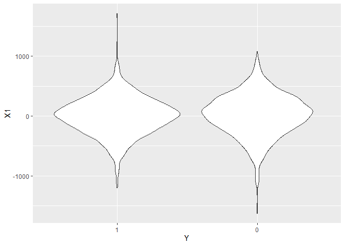<!-- -->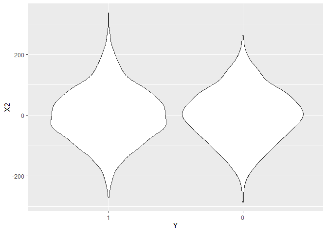<!-- -->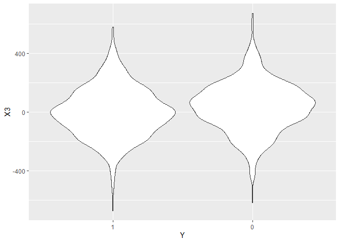<!-- --><!-- --><!-- -->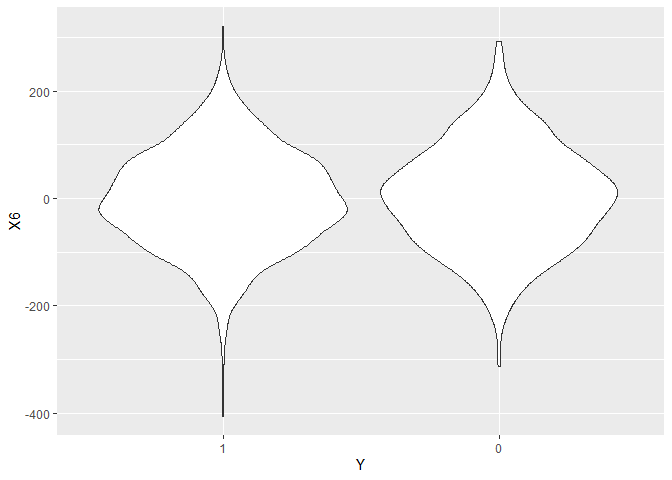<!-- --><!-- --><!-- --><!-- --><!-- --><!-- -->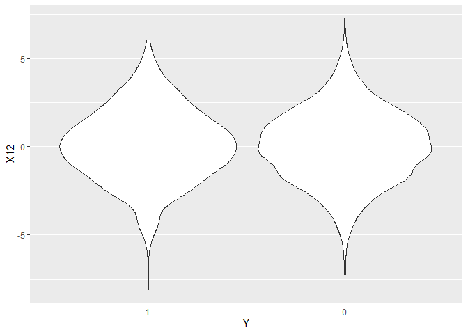<!-- -->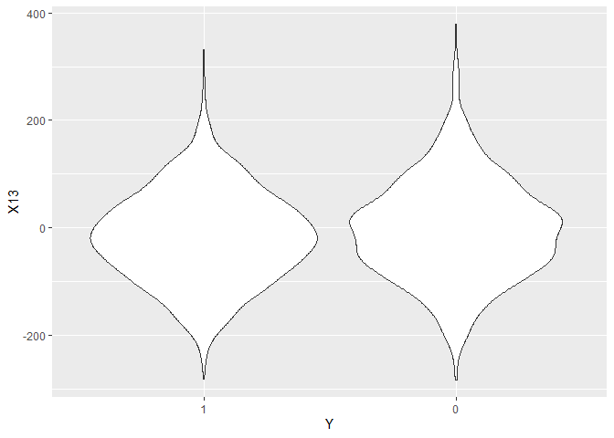<!-- -->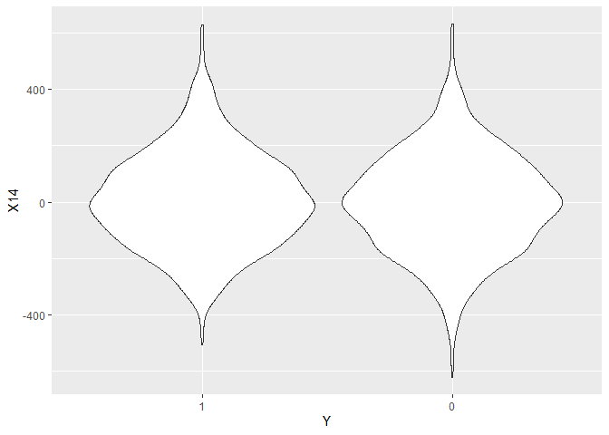<!-- --><!-- -->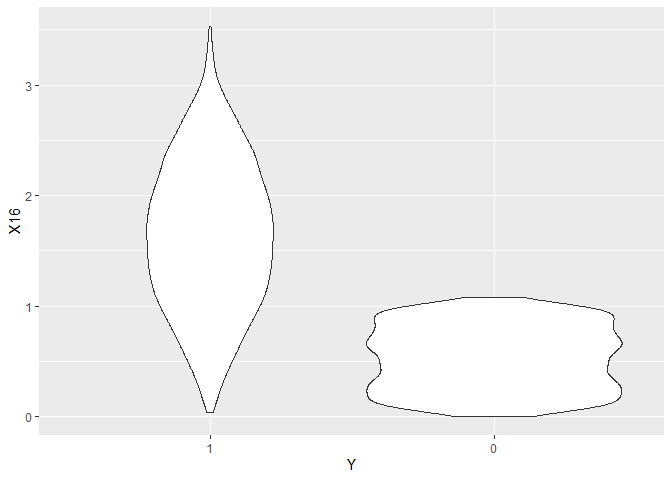<!-- --><!-- --><!-- --><!-- --><!-- -->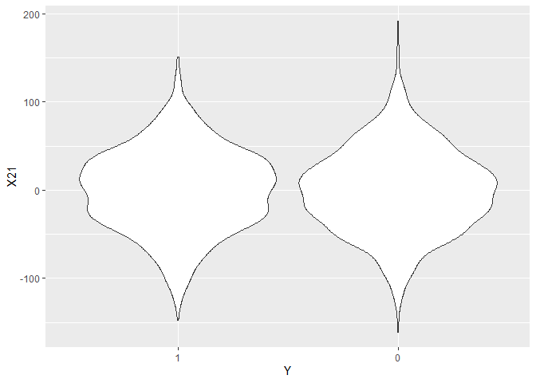<!-- --><!-- --><!-- -->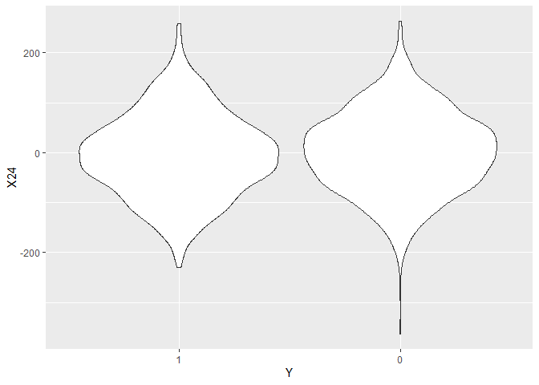<!-- -->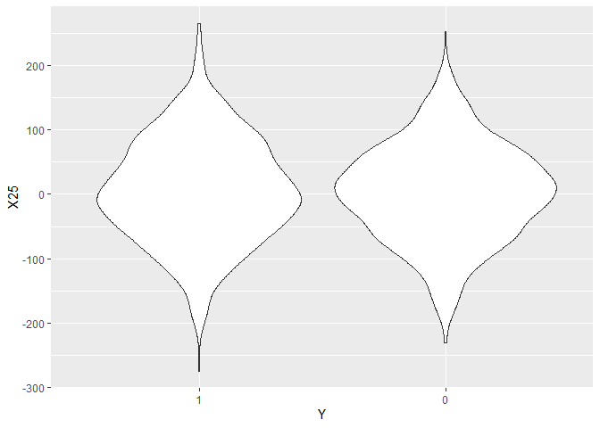<!-- --><!-- --><!-- -->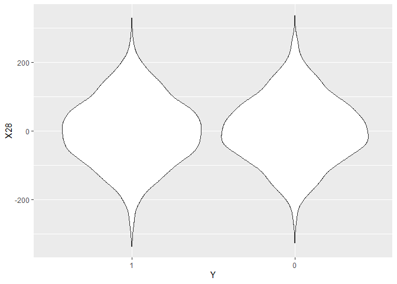<!-- -->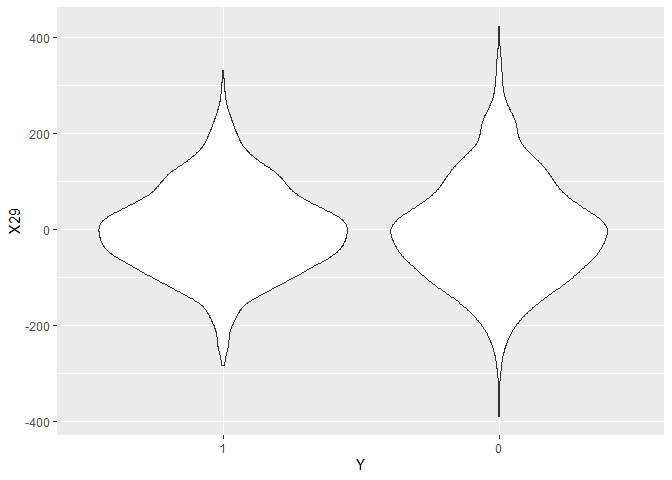<!-- -->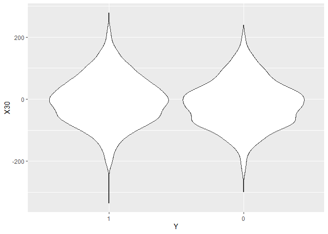<!-- -->

```r
library(ggplot2)
library(GGally)
```

```
## Warning: package 'GGally' was built under R version 3.6.3
```

```
## Registered S3 method overwritten by 'GGally':
##   method from   
##   +.gg   ggplot2
```

```
## 
## Attaching package: 'GGally'
```

```
## The following object is masked from 'package:dplyr':
## 
##     nasa
```

```r
ggpairs(training[,c(1:10,31)])
```

```
## `stat_bin()` using `bins = 30`. Pick better value with `binwidth`.
```

```
## `stat_bin()` using `bins = 30`. Pick better value with `binwidth`.
## `stat_bin()` using `bins = 30`. Pick better value with `binwidth`.
## `stat_bin()` using `bins = 30`. Pick better value with `binwidth`.
## `stat_bin()` using `bins = 30`. Pick better value with `binwidth`.
## `stat_bin()` using `bins = 30`. Pick better value with `binwidth`.
## `stat_bin()` using `bins = 30`. Pick better value with `binwidth`.
## `stat_bin()` using `bins = 30`. Pick better value with `binwidth`.
## `stat_bin()` using `bins = 30`. Pick better value with `binwidth`.
## `stat_bin()` using `bins = 30`. Pick better value with `binwidth`.
```

<!-- -->

```r
library("Hmisc")
```

```
## Warning: package 'Hmisc' was built under R version 3.6.3
```

```
## Loading required package: survival
```

```
## Warning: package 'survival' was built under R version 3.6.3
```

```
## 
## Attaching package: 'survival'
```

```
## The following object is masked from 'package:caret':
## 
##     cluster
```

```
## Loading required package: Formula
```

```
## 
## Attaching package: 'Hmisc'
```

```
## The following objects are masked from 'package:dplyr':
## 
##     src, summarize
```

```
## The following objects are masked from 'package:base':
## 
##     format.pval, units
```

```r
res2 <- rcorr(as.matrix(testing))

flattenCorrMatrix <- function(cormat, pmat) {
  ut <- upper.tri(cormat)
  data.frame(
    row = rownames(cormat)[row(cormat)[ut]],
    column = rownames(cormat)[col(cormat)[ut]],
    cor  =(cormat)[ut],
    p = pmat[ut]
    )
}
View(flattenCorrMatrix(res2$r, res2$P))
library(corrplot)
```

```
## corrplot 0.84 loaded
```

```r
res <- cor(as.matrix(cbind(testing[,1:30],as.numeric(testing[,31]))))

corrplot(res, type = "upper", order = "hclust", 
         tl.col = "black", tl.srt = 45)
```

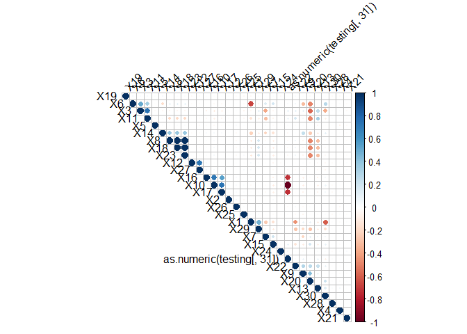<!-- -->

```r
corrplot(res2$r, type="upper", order="hclust", 
         p.mat = res2$P, sig.level = 0.01, insig = "blank")
```

<!-- -->

```r
library(AppliedPredictiveModeling)
```

```
## Warning: package 'AppliedPredictiveModeling' was built under R version 3.6.2
```

```r
transparentTheme(trans = .4)
plotSubset <- data.frame(scale(training[, c("X2", "X16")])) 
xyplot(X2 ~ X16,
       data = plotSubset,
       groups = training$Y, 
       auto.key = list(columns = 2))  
```

<!-- -->

```r
transformed <- spatialSign(plotSubset)
transformed <- as.data.frame(transformed)
xyplot(X2 ~ X16, 
       data = transformed, 
       groups = training$Y, 
       auto.key = list(columns = 2)) 
```

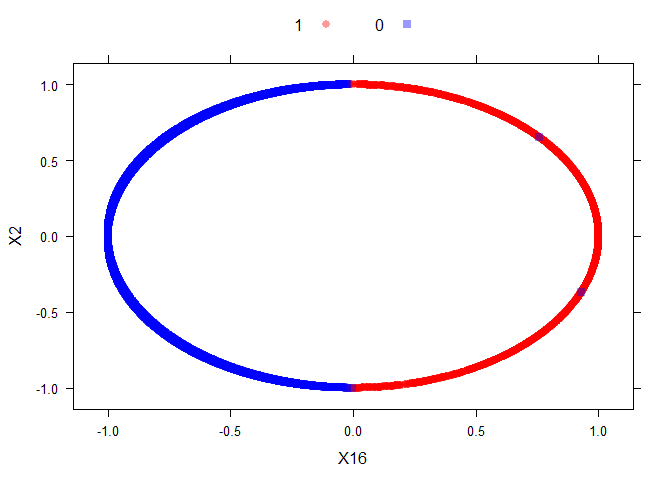<!-- -->

```r
pp <- preProcess(training, 
                     method="pca", pcaComp=20)
pp
```

```
## Created from 7001 samples and 31 variables
## 
## Pre-processing:
##   - centered (30)
##   - ignored (1)
##   - principal component signal extraction (30)
##   - scaled (30)
## 
## PCA used 20 components as specified
```

```r
transformed <- predict(pp, newdata = training)
head(transformed)
```

```
##   Y        PC1       PC2        PC3        PC4        PC5         PC6
## 2 1  1.0299200 1.9300619  0.6764811  0.7271292  1.2251198  4.06193195
## 4 0 -1.9244947 2.0435060 -1.6431941 -2.0661711 -2.7783442  0.58514460
## 5 1 -0.5071440 1.0112557  0.6520691  0.3906206  0.6519003 -0.06675574
## 6 0 -1.6695643 0.1020718 -2.5787381 -0.9796124 -0.3891633  0.85545209
## 7 1  0.7603058 5.1828019  3.2712219 -1.4247409 -1.3325532  0.79144701
## 9 1 -2.4278200 0.7442037 -1.7330140  0.6894292  0.1515836  0.05663705
##          PC7        PC8        PC9        PC10       PC11       PC12
## 2 -0.1688613  0.2044144 -0.4428622 -1.07694277  0.4438100 -0.2081145
## 4  0.8557337 -0.9736740 -0.8563529  0.08121079 -0.8375315 -1.0884467
## 5 -1.6286327 -0.3072522 -0.4119175 -0.08710021  1.5435908 -0.4799566
## 6 -2.2408913  1.7757733 -1.5801230  0.33008912  2.5032011 -1.8148253
## 7 -1.1822204 -0.4580316  0.4409245 -0.15596367  2.0470375 -0.6227429
## 9 -1.5109488 -1.3193503  0.1693239  0.96579263  0.9163505  1.9187017
##          PC13        PC14       PC15        PC16       PC17       PC18
## 2 -1.02128399  2.02550437  0.5845418  0.02371371  1.4061829 -0.5723959
## 4 -0.61364432  1.52563913  0.2061658 -0.53373989  0.1304597  0.0766540
## 5  0.51578062  1.53316843  1.1354810  0.22711377 -0.8468009 -0.7260810
## 6 -0.39060651  1.43719970 -0.6910670 -1.91176978 -0.4227296  0.1107246
## 7 -0.28043954 -0.08584894  0.6352005  1.78874321 -1.4717745 -1.0777109
## 9 -0.03967518 -1.14044910  0.4935561 -0.63951561 -1.6455255 -0.5213462
##          PC19       PC20
## 2  1.12200491 -0.3449939
## 4  0.27244823  0.6217000
## 5 -0.09886768 -0.1555985
## 6 -1.11521882 -0.2360884
## 7 -1.58929574  0.7529015
## 9  1.41517306  0.7800178
```

```r
ggpairs(transformed[,1:10])
```

```
## `stat_bin()` using `bins = 30`. Pick better value with `binwidth`.
## `stat_bin()` using `bins = 30`. Pick better value with `binwidth`.
## `stat_bin()` using `bins = 30`. Pick better value with `binwidth`.
## `stat_bin()` using `bins = 30`. Pick better value with `binwidth`.
## `stat_bin()` using `bins = 30`. Pick better value with `binwidth`.
## `stat_bin()` using `bins = 30`. Pick better value with `binwidth`.
## `stat_bin()` using `bins = 30`. Pick better value with `binwidth`.
## `stat_bin()` using `bins = 30`. Pick better value with `binwidth`.
## `stat_bin()` using `bins = 30`. Pick better value with `binwidth`.
```

<!-- -->


# ensemble

```r
library(party)
```

```
## Warning: package 'party' was built under R version 3.6.3
```

```
## Loading required package: grid
```

```
## Loading required package: mvtnorm
```

```
## Warning: package 'mvtnorm' was built under R version 3.6.2
```

```
## Loading required package: modeltools
```

```
## Warning: package 'modeltools' was built under R version 3.6.3
```

```
## Loading required package: stats4
```

```
## Loading required package: strucchange
```

```
## Loading required package: zoo
```

```
## Warning: package 'zoo' was built under R version 3.6.3
```

```
## 
## Attaching package: 'zoo'
```

```
## The following objects are masked from 'package:base':
## 
##     as.Date, as.Date.numeric
```

```
## Loading required package: sandwich
```

```r
require(randomForest)
```

```
## Loading required package: randomForest
```

```
## Warning: package 'randomForest' was built under R version 3.6.2
```

```
## randomForest 4.6-14
```

```
## Type rfNews() to see new features/changes/bug fixes.
```

```
## 
## Attaching package: 'randomForest'
```

```
## The following object is masked from 'package:dplyr':
## 
##     combine
```

```
## The following object is masked from 'package:ggplot2':
## 
##     margin
```

```r
library(ada)
```

```
## Warning: package 'ada' was built under R version 3.6.3
```

```
## Loading required package: rpart
```

```r
mod1 <- train(Y ~., method ="glm", data = transformed)
```

```
## Warning: glm.fit: fitted probabilities numerically 0 or 1 occurred
```

```
## Warning: glm.fit: fitted probabilities numerically 0 or 1 occurred
```

```
## Warning: glm.fit: algorithm did not converge
```

```
## Warning: glm.fit: fitted probabilities numerically 0 or 1 occurred

## Warning: glm.fit: fitted probabilities numerically 0 or 1 occurred

## Warning: glm.fit: fitted probabilities numerically 0 or 1 occurred

## Warning: glm.fit: fitted probabilities numerically 0 or 1 occurred

## Warning: glm.fit: fitted probabilities numerically 0 or 1 occurred

## Warning: glm.fit: fitted probabilities numerically 0 or 1 occurred

## Warning: glm.fit: fitted probabilities numerically 0 or 1 occurred

## Warning: glm.fit: fitted probabilities numerically 0 or 1 occurred

## Warning: glm.fit: fitted probabilities numerically 0 or 1 occurred

## Warning: glm.fit: fitted probabilities numerically 0 or 1 occurred

## Warning: glm.fit: fitted probabilities numerically 0 or 1 occurred
```

```
## Warning: glm.fit: algorithm did not converge
```

```
## Warning: glm.fit: fitted probabilities numerically 0 or 1 occurred

## Warning: glm.fit: fitted probabilities numerically 0 or 1 occurred

## Warning: glm.fit: fitted probabilities numerically 0 or 1 occurred
```

```
## Warning: glm.fit: algorithm did not converge
```

```
## Warning: glm.fit: fitted probabilities numerically 0 or 1 occurred

## Warning: glm.fit: fitted probabilities numerically 0 or 1 occurred

## Warning: glm.fit: fitted probabilities numerically 0 or 1 occurred

## Warning: glm.fit: fitted probabilities numerically 0 or 1 occurred
```

```
## Warning: glm.fit: algorithm did not converge
```

```
## Warning: glm.fit: fitted probabilities numerically 0 or 1 occurred

## Warning: glm.fit: fitted probabilities numerically 0 or 1 occurred
```

```
## Warning: glm.fit: algorithm did not converge
```

```
## Warning: glm.fit: fitted probabilities numerically 0 or 1 occurred
```

```
## Warning: glm.fit: algorithm did not converge
```

```
## Warning: glm.fit: fitted probabilities numerically 0 or 1 occurred

## Warning: glm.fit: fitted probabilities numerically 0 or 1 occurred

## Warning: glm.fit: fitted probabilities numerically 0 or 1 occurred
```

```r
mod2 <- train(Y~., method ="rf", data = transformed, trControl = trainControl(method = "cv"),number = 10)
mod3 <- train(Y~., method ="rpart", data = transformed)
mod4 <- train(Y~., method ="ctree", data = transformed)
# mod4 <- train(Y~., method ="ctree", data = training[,-10])

mod5 <- ada(Y~.,data=transformed,iter=1000,nu=1,type="discrete")
```

### compare them

```r
transform_testing  <- predict(pp, newdata = testing)

pred1 <- predict(mod1, transform_testing)
pred2 <- predict(mod2, transform_testing)
pred3 <- predict(mod3, transform_testing)
pred4 <- predict(mod4, transform_testing)
pred5 <- predict(mod5, transform_testing)

MLmetrics::Accuracy(pred5,transform_testing$Y)
```

```
## [1] 0.9986662
```

```r
confusionMatrix(pred1,transform_testing$Y)
```

```
## Confusion Matrix and Statistics
## 
##           Reference
## Prediction    1    0
##          1 1514    0
##          0    1 1484
##                                      
##                Accuracy : 0.9997     
##                  95% CI : (0.9981, 1)
##     No Information Rate : 0.5052     
##     P-Value [Acc > NIR] : <2e-16     
##                                      
##                   Kappa : 0.9993     
##                                      
##  Mcnemar's Test P-Value : 1          
##                                      
##             Sensitivity : 0.9993     
##             Specificity : 1.0000     
##          Pos Pred Value : 1.0000     
##          Neg Pred Value : 0.9993     
##              Prevalence : 0.5052     
##          Detection Rate : 0.5048     
##    Detection Prevalence : 0.5048     
##       Balanced Accuracy : 0.9997     
##                                      
##        'Positive' Class : 1          
## 
```

```r
confusionMatrix(pred2,testing$Y)
```

```
## Confusion Matrix and Statistics
## 
##           Reference
## Prediction    1    0
##          1 1506    3
##          0    9 1481
##                                          
##                Accuracy : 0.996          
##                  95% CI : (0.993, 0.9979)
##     No Information Rate : 0.5052         
##     P-Value [Acc > NIR] : <2e-16         
##                                          
##                   Kappa : 0.992          
##                                          
##  Mcnemar's Test P-Value : 0.1489         
##                                          
##             Sensitivity : 0.9941         
##             Specificity : 0.9980         
##          Pos Pred Value : 0.9980         
##          Neg Pred Value : 0.9940         
##              Prevalence : 0.5052         
##          Detection Rate : 0.5022         
##    Detection Prevalence : 0.5032         
##       Balanced Accuracy : 0.9960         
##                                          
##        'Positive' Class : 1              
## 
```

```r
confusionMatrix(pred3,testing$Y)
```

```
## Confusion Matrix and Statistics
## 
##           Reference
## Prediction    1    0
##          1 1448  154
##          0   67 1330
##                                           
##                Accuracy : 0.9263          
##                  95% CI : (0.9164, 0.9354)
##     No Information Rate : 0.5052          
##     P-Value [Acc > NIR] : < 2.2e-16       
##                                           
##                   Kappa : 0.8525          
##                                           
##  Mcnemar's Test P-Value : 7.252e-09       
##                                           
##             Sensitivity : 0.9558          
##             Specificity : 0.8962          
##          Pos Pred Value : 0.9039          
##          Neg Pred Value : 0.9520          
##              Prevalence : 0.5052          
##          Detection Rate : 0.4828          
##    Detection Prevalence : 0.5342          
##       Balanced Accuracy : 0.9260          
##                                           
##        'Positive' Class : 1               
## 
```

```r
confusionMatrix(pred4,testing$Y)
```

```
## Confusion Matrix and Statistics
## 
##           Reference
## Prediction    1    0
##          1 1500   26
##          0   15 1458
##                                           
##                Accuracy : 0.9863          
##                  95% CI : (0.9815, 0.9902)
##     No Information Rate : 0.5052          
##     P-Value [Acc > NIR] : <2e-16          
##                                           
##                   Kappa : 0.9727          
##                                           
##  Mcnemar's Test P-Value : 0.1183          
##                                           
##             Sensitivity : 0.9901          
##             Specificity : 0.9825          
##          Pos Pred Value : 0.9830          
##          Neg Pred Value : 0.9898          
##              Prevalence : 0.5052          
##          Detection Rate : 0.5002          
##    Detection Prevalence : 0.5088          
##       Balanced Accuracy : 0.9863          
##                                           
##        'Positive' Class : 1               
## 
```

```r
confusionMatrix(pred5,testing$Y)
```

```
## Warning in confusionMatrix.default(pred5, testing$Y): Levels are not in the same
## order for reference and data. Refactoring data to match.
```

```
## Confusion Matrix and Statistics
## 
##           Reference
## Prediction    1    0
##          1 1512    1
##          0    3 1483
##                                           
##                Accuracy : 0.9987          
##                  95% CI : (0.9966, 0.9996)
##     No Information Rate : 0.5052          
##     P-Value [Acc > NIR] : <2e-16          
##                                           
##                   Kappa : 0.9973          
##                                           
##  Mcnemar's Test P-Value : 0.6171          
##                                           
##             Sensitivity : 0.9980          
##             Specificity : 0.9993          
##          Pos Pred Value : 0.9993          
##          Neg Pred Value : 0.9980          
##              Prevalence : 0.5052          
##          Detection Rate : 0.5042          
##    Detection Prevalence : 0.5045          
##       Balanced Accuracy : 0.9987          
##                                           
##        'Positive' Class : 1               
## 
```

```r
library(rattle)
```

```
## Warning: package 'rattle' was built under R version 3.6.2
```

```
## Rattle: A free graphical interface for data science with R.
## Version 5.3.0 Copyright (c) 2006-2018 Togaware Pty Ltd.
## Type 'rattle()' to shake, rattle, and roll your data.
```

```
## 
## Attaching package: 'rattle'
```

```
## The following object is masked from 'package:randomForest':
## 
##     importance
```

```r
fancyRpartPlot(mod3$finalModel)
```

<!-- -->

```r
plot(mod4$finalModel)
```

<!-- -->

```r
plot(mod1$finalModel)
```

<!-- --><!-- -->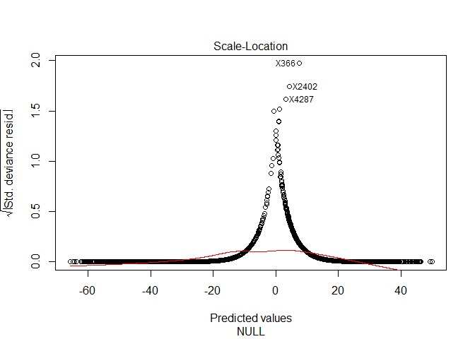<!-- --><!-- -->

```r
varplot(mod5)
```

<!-- -->


```r
predDF4 <- data.frame(pred1, pred2, pred3, pred4, pred5, Y = testing$Y)
combModFit4 <- train(Y~., method = "gam", data = predDF4)
```

```
## Loading required package: mgcv
```

```
## Loading required package: nlme
```

```
## 
## Attaching package: 'nlme'
```

```
## The following object is masked from 'package:dplyr':
## 
##     collapse
```

```
## This is mgcv 1.8-28. For overview type 'help("mgcv-package")'.
```

```
## Warning in gam.fit3(x = args$X, y = args$y, sp = lsp, Eb = args$Eb, UrS =
## args$UrS, : fitted probabilities numerically 0 or 1 occurred

## Warning in gam.fit3(x = args$X, y = args$y, sp = lsp, Eb = args$Eb, UrS =
## args$UrS, : fitted probabilities numerically 0 or 1 occurred

## Warning in gam.fit3(x = args$X, y = args$y, sp = lsp, Eb = args$Eb, UrS =
## args$UrS, : fitted probabilities numerically 0 or 1 occurred

## Warning in gam.fit3(x = args$X, y = args$y, sp = lsp, Eb = args$Eb, UrS =
## args$UrS, : fitted probabilities numerically 0 or 1 occurred

## Warning in gam.fit3(x = args$X, y = args$y, sp = lsp, Eb = args$Eb, UrS =
## args$UrS, : fitted probabilities numerically 0 or 1 occurred

## Warning in gam.fit3(x = args$X, y = args$y, sp = lsp, Eb = args$Eb, UrS =
## args$UrS, : fitted probabilities numerically 0 or 1 occurred

## Warning in gam.fit3(x = args$X, y = args$y, sp = lsp, Eb = args$Eb, UrS =
## args$UrS, : fitted probabilities numerically 0 or 1 occurred

## Warning in gam.fit3(x = args$X, y = args$y, sp = lsp, Eb = args$Eb, UrS =
## args$UrS, : fitted probabilities numerically 0 or 1 occurred

## Warning in gam.fit3(x = args$X, y = args$y, sp = lsp, Eb = args$Eb, UrS =
## args$UrS, : fitted probabilities numerically 0 or 1 occurred

## Warning in gam.fit3(x = args$X, y = args$y, sp = lsp, Eb = args$Eb, UrS =
## args$UrS, : fitted probabilities numerically 0 or 1 occurred

## Warning in gam.fit3(x = args$X, y = args$y, sp = lsp, Eb = args$Eb, UrS =
## args$UrS, : fitted probabilities numerically 0 or 1 occurred

## Warning in gam.fit3(x = args$X, y = args$y, sp = lsp, Eb = args$Eb, UrS =
## args$UrS, : fitted probabilities numerically 0 or 1 occurred

## Warning in gam.fit3(x = args$X, y = args$y, sp = lsp, Eb = args$Eb, UrS =
## args$UrS, : fitted probabilities numerically 0 or 1 occurred

## Warning in gam.fit3(x = args$X, y = args$y, sp = lsp, Eb = args$Eb, UrS =
## args$UrS, : fitted probabilities numerically 0 or 1 occurred

## Warning in gam.fit3(x = args$X, y = args$y, sp = lsp, Eb = args$Eb, UrS =
## args$UrS, : fitted probabilities numerically 0 or 1 occurred

## Warning in gam.fit3(x = args$X, y = args$y, sp = lsp, Eb = args$Eb, UrS =
## args$UrS, : fitted probabilities numerically 0 or 1 occurred

## Warning in gam.fit3(x = args$X, y = args$y, sp = lsp, Eb = args$Eb, UrS =
## args$UrS, : fitted probabilities numerically 0 or 1 occurred

## Warning in gam.fit3(x = args$X, y = args$y, sp = lsp, Eb = args$Eb, UrS =
## args$UrS, : fitted probabilities numerically 0 or 1 occurred

## Warning in gam.fit3(x = args$X, y = args$y, sp = lsp, Eb = args$Eb, UrS =
## args$UrS, : fitted probabilities numerically 0 or 1 occurred

## Warning in gam.fit3(x = args$X, y = args$y, sp = lsp, Eb = args$Eb, UrS =
## args$UrS, : fitted probabilities numerically 0 or 1 occurred

## Warning in gam.fit3(x = args$X, y = args$y, sp = lsp, Eb = args$Eb, UrS =
## args$UrS, : fitted probabilities numerically 0 or 1 occurred

## Warning in gam.fit3(x = args$X, y = args$y, sp = lsp, Eb = args$Eb, UrS =
## args$UrS, : fitted probabilities numerically 0 or 1 occurred

## Warning in gam.fit3(x = args$X, y = args$y, sp = lsp, Eb = args$Eb, UrS =
## args$UrS, : fitted probabilities numerically 0 or 1 occurred

## Warning in gam.fit3(x = args$X, y = args$y, sp = lsp, Eb = args$Eb, UrS =
## args$UrS, : fitted probabilities numerically 0 or 1 occurred

## Warning in gam.fit3(x = args$X, y = args$y, sp = lsp, Eb = args$Eb, UrS =
## args$UrS, : fitted probabilities numerically 0 or 1 occurred

## Warning in gam.fit3(x = args$X, y = args$y, sp = lsp, Eb = args$Eb, UrS =
## args$UrS, : fitted probabilities numerically 0 or 1 occurred

## Warning in gam.fit3(x = args$X, y = args$y, sp = lsp, Eb = args$Eb, UrS =
## args$UrS, : fitted probabilities numerically 0 or 1 occurred

## Warning in gam.fit3(x = args$X, y = args$y, sp = lsp, Eb = args$Eb, UrS =
## args$UrS, : fitted probabilities numerically 0 or 1 occurred

## Warning in gam.fit3(x = args$X, y = args$y, sp = lsp, Eb = args$Eb, UrS =
## args$UrS, : fitted probabilities numerically 0 or 1 occurred

## Warning in gam.fit3(x = args$X, y = args$y, sp = lsp, Eb = args$Eb, UrS =
## args$UrS, : fitted probabilities numerically 0 or 1 occurred

## Warning in gam.fit3(x = args$X, y = args$y, sp = lsp, Eb = args$Eb, UrS =
## args$UrS, : fitted probabilities numerically 0 or 1 occurred

## Warning in gam.fit3(x = args$X, y = args$y, sp = lsp, Eb = args$Eb, UrS =
## args$UrS, : fitted probabilities numerically 0 or 1 occurred

## Warning in gam.fit3(x = args$X, y = args$y, sp = lsp, Eb = args$Eb, UrS =
## args$UrS, : fitted probabilities numerically 0 or 1 occurred

## Warning in gam.fit3(x = args$X, y = args$y, sp = lsp, Eb = args$Eb, UrS =
## args$UrS, : fitted probabilities numerically 0 or 1 occurred

## Warning in gam.fit3(x = args$X, y = args$y, sp = lsp, Eb = args$Eb, UrS =
## args$UrS, : fitted probabilities numerically 0 or 1 occurred

## Warning in gam.fit3(x = args$X, y = args$y, sp = lsp, Eb = args$Eb, UrS =
## args$UrS, : fitted probabilities numerically 0 or 1 occurred

## Warning in gam.fit3(x = args$X, y = args$y, sp = lsp, Eb = args$Eb, UrS =
## args$UrS, : fitted probabilities numerically 0 or 1 occurred

## Warning in gam.fit3(x = args$X, y = args$y, sp = lsp, Eb = args$Eb, UrS =
## args$UrS, : fitted probabilities numerically 0 or 1 occurred

## Warning in gam.fit3(x = args$X, y = args$y, sp = lsp, Eb = args$Eb, UrS =
## args$UrS, : fitted probabilities numerically 0 or 1 occurred
```

```r
combPred4 <- predict(combModFit4,predDF4)
```


```r
MLmetrics::Accuracy(y_pred = pred1,y_true = testing$Y)
```

```
## [1] 0.9996666
```

```r
MLmetrics::Accuracy(y_pred = pred2,y_true = testing$Y)
```

```
## [1] 0.9959987
```

```r
MLmetrics::Accuracy(y_pred = pred3,y_true = testing$Y)
```

```
## [1] 0.9263088
```

```r
MLmetrics::Accuracy(y_pred = pred4,y_true = testing$Y)
```

```
## [1] 0.9863288
```

```r
MLmetrics::Accuracy(y_pred = pred5,y_true = testing$Y)
```

```
## [1] 0.9986662
```

```r
MLmetrics::Accuracy(y_pred = combPred4,y_true = testing$Y)
```

```
## [1] 0.9996666
```

```r
plot(combModFit4)
```

<!-- -->


```r
trans_test  <- predict(pp, newdata = test)

pred1V <- predict(mod1, trans_test)
pred2V <- predict(mod2, trans_test)
pred3V <- predict(mod3, trans_test)
pred4V <- predict(mod4, trans_test)
pred5V <- predict(mod4, trans_test)

predVDF4 <-
    data.frame(
        pred1 = pred1V,
        pred2 = pred2V,
        pred3 = pred3V,
        pred4 = pred4V,
        pred5 = pred5V

    )
combPredV5 <- predict(combModFit4,predVDF4,type="prob")
# View(combPredV5)
rfresults <- predict(mod2, trans_test,type="prob")
ctreeresults <- predict(mod4, trans_test,type="prob")
ada_res <- predict(mod1, trans_test,type="prob" )

View(ada_res)
```

## export

```r
export <- combPredV5[,1]
write.table(export, file = "results.csv",row.names = FALSE, dec = ".", sep = ",", col.names = F)
export <- ada_res[,2]
write.table(export, file = "ada_results.csv",row.names = FALSE, dec = ".", sep = ",", col.names = F)
```

