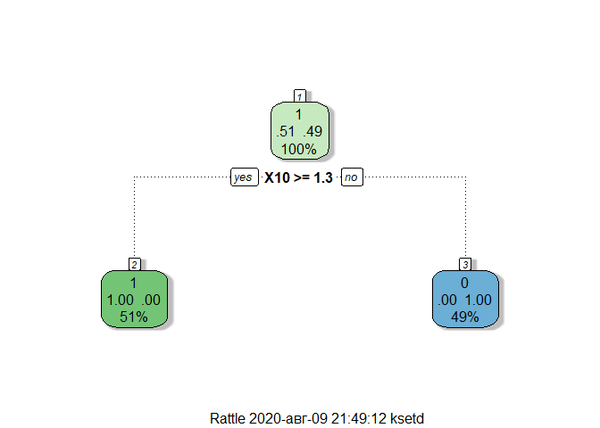

## import

```r
library(readr)
train <- read_csv("data/train.csv", col_names = FALSE)
```

```
## Parsed with column specification:
## cols(
##   .default = col_double()
## )
```

```
## See spec(...) for full column specifications.
```

```r
# View(train)
test <- read_csv("data/test.csv", col_names = FALSE)
```

```
## Parsed with column specification:
## cols(
##   .default = col_double()
## )
## See spec(...) for full column specifications.
```

```r
Y  <- read_csv("data/train-target.csv", 
    col_names = FALSE, col_types = cols(X1 = col_factor()))
names(Y) <- "Y"
train <- cbind(train,Y)
```


## prep

```r
library(ISLR)
library(ggplot2)
library(caret)

inTrain <- createDataPartition(train$Y, p=0.95, list = FALSE)
training <- train[inTrain,]
testing <- train[-inTrain,]
```

# ensemble

```r
library(party)
require(randomForest)
mod1 <- train(Y ~., method ="glm", data = training)
```

```
## Warning: glm.fit: algorithm did not converge
```

```
## Warning in predict.lm(object, newdata, se.fit, scale = 1, type = if (type == :
## prediction from a rank-deficient fit may be misleading
```

```
## Warning: glm.fit: algorithm did not converge
```

```
## Warning in predict.lm(object, newdata, se.fit, scale = 1, type = if (type == :
## prediction from a rank-deficient fit may be misleading
```

```
## Warning: glm.fit: algorithm did not converge
```

```
## Warning in predict.lm(object, newdata, se.fit, scale = 1, type = if (type == :
## prediction from a rank-deficient fit may be misleading
```

```
## Warning: glm.fit: algorithm did not converge
```

```
## Warning in predict.lm(object, newdata, se.fit, scale = 1, type = if (type == :
## prediction from a rank-deficient fit may be misleading
```

```
## Warning: glm.fit: algorithm did not converge
```

```
## Warning in predict.lm(object, newdata, se.fit, scale = 1, type = if (type == :
## prediction from a rank-deficient fit may be misleading
```

```
## Warning: glm.fit: algorithm did not converge
```

```
## Warning in predict.lm(object, newdata, se.fit, scale = 1, type = if (type == :
## prediction from a rank-deficient fit may be misleading
```

```
## Warning: glm.fit: algorithm did not converge
```

```
## Warning in predict.lm(object, newdata, se.fit, scale = 1, type = if (type == :
## prediction from a rank-deficient fit may be misleading
```

```
## Warning: glm.fit: algorithm did not converge
```

```
## Warning in predict.lm(object, newdata, se.fit, scale = 1, type = if (type == :
## prediction from a rank-deficient fit may be misleading
```

```
## Warning: glm.fit: algorithm did not converge
```

```
## Warning in predict.lm(object, newdata, se.fit, scale = 1, type = if (type == :
## prediction from a rank-deficient fit may be misleading
```

```
## Warning: glm.fit: algorithm did not converge
```

```
## Warning in predict.lm(object, newdata, se.fit, scale = 1, type = if (type == :
## prediction from a rank-deficient fit may be misleading
```

```
## Warning: glm.fit: algorithm did not converge
```

```
## Warning in predict.lm(object, newdata, se.fit, scale = 1, type = if (type == :
## prediction from a rank-deficient fit may be misleading
```

```
## Warning: glm.fit: algorithm did not converge
```

```
## Warning in predict.lm(object, newdata, se.fit, scale = 1, type = if (type == :
## prediction from a rank-deficient fit may be misleading
```

```
## Warning: glm.fit: algorithm did not converge
```

```
## Warning in predict.lm(object, newdata, se.fit, scale = 1, type = if (type == :
## prediction from a rank-deficient fit may be misleading
```

```
## Warning: glm.fit: algorithm did not converge
```

```
## Warning in predict.lm(object, newdata, se.fit, scale = 1, type = if (type == :
## prediction from a rank-deficient fit may be misleading
```

```
## Warning: glm.fit: algorithm did not converge
```

```
## Warning in predict.lm(object, newdata, se.fit, scale = 1, type = if (type == :
## prediction from a rank-deficient fit may be misleading
```

```
## Warning: glm.fit: algorithm did not converge
```

```
## Warning in predict.lm(object, newdata, se.fit, scale = 1, type = if (type == :
## prediction from a rank-deficient fit may be misleading
```

```
## Warning: glm.fit: algorithm did not converge
```

```
## Warning in predict.lm(object, newdata, se.fit, scale = 1, type = if (type == :
## prediction from a rank-deficient fit may be misleading
```

```
## Warning: glm.fit: algorithm did not converge
```

```
## Warning in predict.lm(object, newdata, se.fit, scale = 1, type = if (type == :
## prediction from a rank-deficient fit may be misleading
```

```
## Warning: glm.fit: algorithm did not converge
```

```
## Warning in predict.lm(object, newdata, se.fit, scale = 1, type = if (type == :
## prediction from a rank-deficient fit may be misleading
```

```
## Warning: glm.fit: algorithm did not converge
```

```
## Warning in predict.lm(object, newdata, se.fit, scale = 1, type = if (type == :
## prediction from a rank-deficient fit may be misleading
```

```
## Warning: glm.fit: algorithm did not converge
```

```
## Warning in predict.lm(object, newdata, se.fit, scale = 1, type = if (type == :
## prediction from a rank-deficient fit may be misleading
```

```
## Warning: glm.fit: algorithm did not converge
```

```
## Warning in predict.lm(object, newdata, se.fit, scale = 1, type = if (type == :
## prediction from a rank-deficient fit may be misleading
```

```
## Warning: glm.fit: algorithm did not converge
```

```
## Warning in predict.lm(object, newdata, se.fit, scale = 1, type = if (type == :
## prediction from a rank-deficient fit may be misleading
```

```
## Warning: glm.fit: algorithm did not converge
```

```
## Warning in predict.lm(object, newdata, se.fit, scale = 1, type = if (type == :
## prediction from a rank-deficient fit may be misleading
```

```
## Warning: glm.fit: algorithm did not converge
```

```
## Warning in predict.lm(object, newdata, se.fit, scale = 1, type = if (type == :
## prediction from a rank-deficient fit may be misleading
```

```
## Warning: glm.fit: algorithm did not converge
```

```r
mod2 <- train(Y~., method ="rf", data = training, trControl = trainControl(method = "cv"),number = 10)
mod3 <- train(Y~., method ="rpart", data = training)
mod4 <- train(Y~., method ="ctree", data = training)
# mod5 <- mob(Y~., data = training)
```

### compare them

```r
pred1 <- predict(mod1, testing)
```

```
## Warning in predict.lm(object, newdata, se.fit, scale = 1, type = if (type == :
## prediction from a rank-deficient fit may be misleading
```

```r
pred2 <- predict(mod2, testing)
pred3 <- predict(mod3, testing)
pred4 <- predict(mod4, testing)
MLmetrics::Accuracy(pred2,testing$Y)
```

```
## [1] 1
```

```r
confusionMatrix(pred1,testing$Y)
```

```
## Confusion Matrix and Statistics
## 
##           Reference
## Prediction   1   0
##          1 252   0
##          0   0 247
##                                      
##                Accuracy : 1          
##                  95% CI : (0.9926, 1)
##     No Information Rate : 0.505      
##     P-Value [Acc > NIR] : < 2.2e-16  
##                                      
##                   Kappa : 1          
##                                      
##  Mcnemar's Test P-Value : NA         
##                                      
##             Sensitivity : 1.000      
##             Specificity : 1.000      
##          Pos Pred Value : 1.000      
##          Neg Pred Value : 1.000      
##              Prevalence : 0.505      
##          Detection Rate : 0.505      
##    Detection Prevalence : 0.505      
##       Balanced Accuracy : 1.000      
##                                      
##        'Positive' Class : 1          
## 
```

```r
confusionMatrix(pred2,testing$Y)
```

```
## Confusion Matrix and Statistics
## 
##           Reference
## Prediction   1   0
##          1 252   0
##          0   0 247
##                                      
##                Accuracy : 1          
##                  95% CI : (0.9926, 1)
##     No Information Rate : 0.505      
##     P-Value [Acc > NIR] : < 2.2e-16  
##                                      
##                   Kappa : 1          
##                                      
##  Mcnemar's Test P-Value : NA         
##                                      
##             Sensitivity : 1.000      
##             Specificity : 1.000      
##          Pos Pred Value : 1.000      
##          Neg Pred Value : 1.000      
##              Prevalence : 0.505      
##          Detection Rate : 0.505      
##    Detection Prevalence : 0.505      
##       Balanced Accuracy : 1.000      
##                                      
##        'Positive' Class : 1          
## 
```

```r
confusionMatrix(pred3,testing$Y)
```

```
## Confusion Matrix and Statistics
## 
##           Reference
## Prediction   1   0
##          1 252   0
##          0   0 247
##                                      
##                Accuracy : 1          
##                  95% CI : (0.9926, 1)
##     No Information Rate : 0.505      
##     P-Value [Acc > NIR] : < 2.2e-16  
##                                      
##                   Kappa : 1          
##                                      
##  Mcnemar's Test P-Value : NA         
##                                      
##             Sensitivity : 1.000      
##             Specificity : 1.000      
##          Pos Pred Value : 1.000      
##          Neg Pred Value : 1.000      
##              Prevalence : 0.505      
##          Detection Rate : 0.505      
##    Detection Prevalence : 0.505      
##       Balanced Accuracy : 1.000      
##                                      
##        'Positive' Class : 1          
## 
```

```r
confusionMatrix(pred4,testing$Y)
```

```
## Confusion Matrix and Statistics
## 
##           Reference
## Prediction   1   0
##          1 252   0
##          0   0 247
##                                      
##                Accuracy : 1          
##                  95% CI : (0.9926, 1)
##     No Information Rate : 0.505      
##     P-Value [Acc > NIR] : < 2.2e-16  
##                                      
##                   Kappa : 1          
##                                      
##  Mcnemar's Test P-Value : NA         
##                                      
##             Sensitivity : 1.000      
##             Specificity : 1.000      
##          Pos Pred Value : 1.000      
##          Neg Pred Value : 1.000      
##              Prevalence : 0.505      
##          Detection Rate : 0.505      
##    Detection Prevalence : 0.505      
##       Balanced Accuracy : 1.000      
##                                      
##        'Positive' Class : 1          
## 
```

```r
qplot(pred1,Y, data = testing)
```

<!-- -->

```r
library(rattle)
fancyRpartPlot(mod3$finalModel)
```

<!-- -->

```r
plot(mod4$finalModel)
```

<!-- -->


```r
predDF4 <- data.frame(pred1, pred2, pred3, pred4, Y = testing$Y)
combModFit4 <- train(Y~., method = "gam", data = predDF4)
```

```
## Loading required package: mgcv
```

```
## Loading required package: nlme
```

```
## This is mgcv 1.8-31. For overview type 'help("mgcv-package")'.
```

```r
combPred4 <- predict(combModFit4,predDF4)
```


```r
MLmetrics::Accuracy(y_pred = pred1,y_true = testing$Y)
```

```
## [1] 1
```

```r
MLmetrics::Accuracy(y_pred = pred2,y_true = testing$Y)
```

```
## [1] 1
```

```r
MLmetrics::Accuracy(y_pred = pred3,y_true = testing$Y)
```

```
## [1] 1
```

```r
MLmetrics::Accuracy(y_pred = pred4,y_true = testing$Y)
```

```
## [1] 1
```

```r
MLmetrics::Accuracy(y_pred = combPred4,y_true = testing$Y)
```

```
## [1] 1
```

```r
plot(combModFit4)
```

<!-- -->


```r
pred1V <- predict(mod1, test)
```

```
## Warning in predict.lm(object, newdata, se.fit, scale = 1, type = if (type == :
## prediction from a rank-deficient fit may be misleading
```

```r
pred2V <- predict(mod2, test)
pred3V <- predict(mod3, test)
pred4V <- predict(mod4, test)
predVDF4 <-
    data.frame(
        pred1 = pred1V,
        pred2 = pred2V,
        pred3 = pred3V,
        pred4 = pred4V
    )
combPredV5 <- predict(combModFit4,predVDF4,type="prob")
View(combPredV5)
rfresults <- predict(mod2, test,type="prob")
```

## export

```r
export <- rfresults[,1]
write.table(export, file = "results.csv",row.names = FALSE, dec = ".", sep = ",", col.names = F)
```

